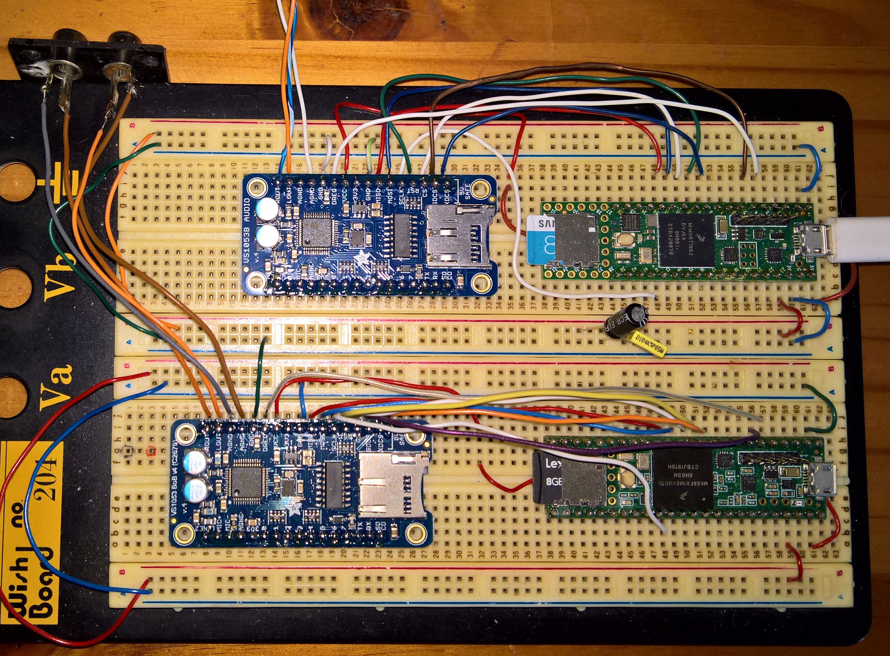

# VS1053B-Teensy36-Teensy41-SDCard-Music-Player
VS1053B Teensy36 Teensy41 SDCard Music Player

 
 

VS1053 Teensy36 Teensy41 SDCard Player

VS1053B		Teensy 
Adafruit	3.6 and 4.1 (*1,*2)
=====================================================================================================================
VCC   5v	 
GND   GND	 
SCLK  Pin 13   SPI Clock, shared with SD card
MISO  Pin 12   Input data, from VS1053/SD card
MOSI  Pin 11   Output data, to VS1053/SD card
CS    Pin 10   VS1053 chip select pin (output)
RST   Pin 09   VS1053 reset pin active low (output)
XDCS  Pin 08   VS1053 Data/command select pin (output)
SDCS  Pin 04   Chip select line for SD card
DREQ  Pin 03   VS1053 Data request (input) (ideally an Interrupt pin)

*1 and *2: Adafruit VS1053B 2020 lib and Teensy 2020 lib with VS1053playerTeensy
*3 Standalone VS1053playerTeensy

For the Teensy 4.1 comment out the Status Register Save SREG else get 'SREG' was not declared in this scope compiler message
See alao: https://forum.pjrc.com/threads/66728-Backup-the-Interrupt-Enable-State-and-Restore-it-on-the-T4-x

A recent topic: https://forum.pjrc.com/threads/70704-VS1053-Adafruit-library-player_simple-example-doesn-t-compile-for-Teensy-4-1

