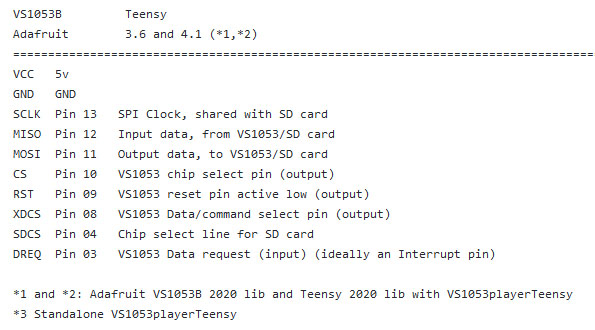

# VS1053B-Teensy36-Teensy41-SDCard-Music-Player
VS1053B Teensy36 Teensy41 SDCard Music Player

 
 

 
 

For the Teensy 4.1 comment out the Status Register Save SREG else get 'SREG' was not declared in this scope compiler message 
See alao: https://forum.pjrc.com/threads/66728-Backup-the-Interrupt-Enable-State-and-Restore-it-on-the-T4-x 

A recent topic: https://forum.pjrc.com/threads/70704-VS1053-Adafruit-library-player_simple-example-doesn-t-compile-for-Teensy-4-1

