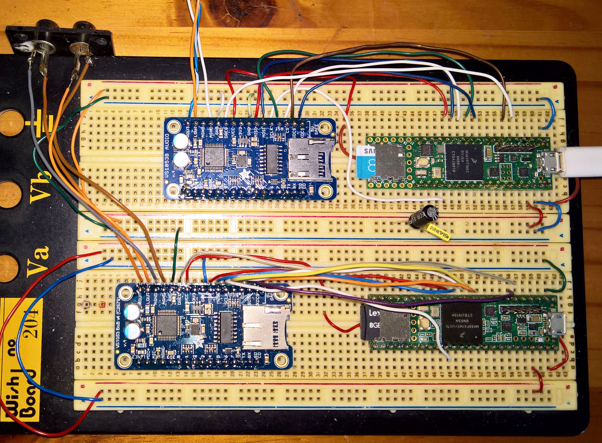

# VS1053B-Teensy36-Teensy41-SDCard-Music-Player
VS1053B Teensy36 Teensy41 SDCard Music Player

 
 

 
 

For the Teensy 4.1 comment out the Status Register Save SREG section - else it cause an 'SREG was not declared in this scope' compiler error. In the newer (2021) version of the Adafruit VS1053 library this is not necessary - SREG is not referred to in Adafruit_VS1053.cpp. See https://forum.pjrc.com/threads/70704-VS1053-Adafruit-library-player_simple-example-doesn-t-compile-for-Teensy-4-1

